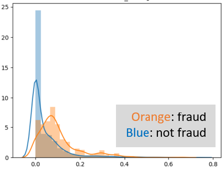
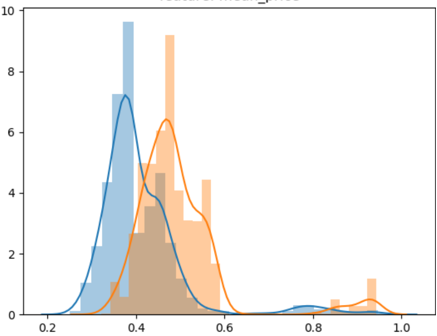
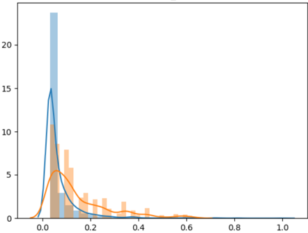
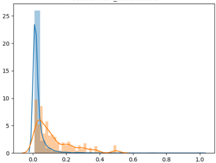
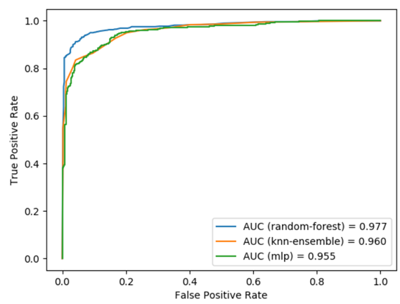

# Transaction Fraud Detection

A data science project to predict whether a transaction is a fraud or not.


## Business Problem

Company A offers users to purchase products through a variety of payment options (payment channels). Each of the payment channels are 
susceptible to fraudulent activities, such as stolen credit card, phishing the one time password for credit card payments, 
unauthorized usage of e-wallets by family members, etc.

Fraudulent activities can lead to loss of revenue and loss of reputation for Company A,
therefore, it is essential to identify potential fraudulent transactions. In this project,
a model predicts if a transaction will be flagged by a user.

## Data

Historical transaction level data (**200,000+** records) with flags showing which of the
transactions are reported by the user of the payment service as fraudulent.

_Note: variable names have been replaced to protect company A's business._


## Solution Strategy

This project deliver prediction results from 3 machine learning models, which can predict whether a transaction is fraudulent or not.

**(1) Data processing, feature engineering and data analysis** 

First, separate data into numerical (`NUM`), categorical (`CAT`), time and date formats (`config.py`). Next, collect and process data given format.
Group data by `person_id` to extract new features (associated to individual clients). The extraction process is done via `multiprocessing` to
speed up the process (`n_workers` corresponds to 4 CPU cores, by default):

```python
new_features, indices = build_features_multiprocessing(
X_PROCESSED, grouped.groups, np, n_workers=int(ARGS.pool_workers))
```

The `person_id`-defined data is re-shaped into an original dataframe structure by allocating the new features at their respective dataframe indices:

```python
X_REDEFINED = reshape_to_original_dataframe(X_PROCESSED, new_features, indices)
```

Data are randomly sampled by class (without imbalance). Examples of distribution plots:

|        Std. variable 1-2        |         Mean variable 6         |         Mean variable 3         |     Number of transactions      |
|:-------------------------------:|:-------------------------------:|:-------------------------------:|:-------------------------------:|
|  |  |  |  |

About features, one assume that fraudsters, e.g. have more transactions (per day, or over lifetime), spend higher amounts per transaction 
(or over a period of time), work in different environments in various places (location mistmatch, VPN/IP), big amounts are regularly spent (price frequency), etc.


**Step 2: Define models, train and test**

Saved data is imported and normalized:

```python
y = pd.read_pickle("data/y.pkl")
X_PROCESSED = pd.read_pickle("data/X_PROCESSED.pkl")
X_REDEFINED = pd.read_pickle("data/X_REDEFINED.pkl")
X_FINAL = pd.concat([X_PROCESSED, X_REDEFINED], axis=1)
X_FINAL = pd.DataFrame(normalize(X_FINAL, norm='max', axis=0), columns=X_FINAL.columns.tolist())
```

Definition of the learning models: Random Forest, KNN with bootstrap aggregation, and Multi-layer perceptron (MLP).

```python
clf1 = RandomForestClassifier()
clf2 = BaggingClassifier(KNeighborsClassifier(n_neighbors=2), max_samples=0.5, max_features=0.5)
clf3 = MLPClassifier(
    solver='adam', max_iter=200, learning_rate_init=1e-2,
    learning_rate='adaptive', alpha=1e-2,
    hidden_layer_sizes=(16, 12, 8, 4), random_state=2)
```

Testing of the models with a k-fold cross-validator:

```python
skf = StratifiedKFold(n_splits=int(ARGS.n_splits))
```

#### Random Forest

|    Precision    |     Recall     |       F1        |
|:---------------:|:--------------:|:---------------:|
| 0.935 +/- 0.007 | 0.952 +/- 0.10 | 0.943 +/- 0.008 |

#### KNN with bagging

|    Precision    |     Recall      |       F1        |
|:---------------:|:---------------:|:---------------:|
| 0.900 +/- 0.003 | 0.893 +/- 0.005 | 0.908 +/- 0.007 |


#### Multi-layer Perceptron (MLP)

|    Precision    |     Recall      |       F1        |
|:---------------:|:---------------:|:---------------:|
| 0.897 +/- 0.012 | 0.908 +/- 0.024 | 0.889 +/- 0.035 |


**Step 3: Analysis of AUC metrics (to compare models)**



## License

This project is licensed under the MIT License - see the [LICENSE](LICENSE) file for details
